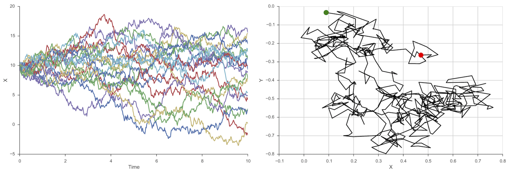
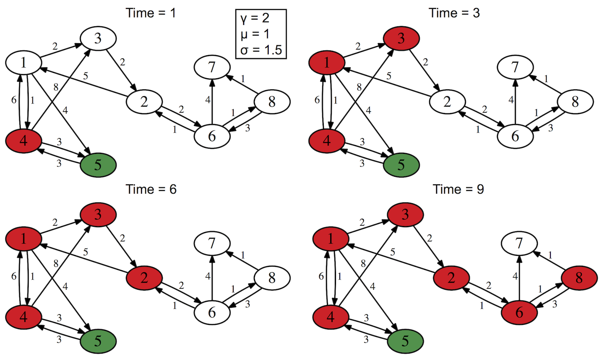

# [The Brownian Wanderlust of Things](http://xrds.acm.org)

## Marinka Zitnik, Spring 2015

<figure><figcaption>Left. A typical plot showing 20 realizations of one-dimensional Brownian motion. Right. A typical plot showing Brownian motion in two dimensions.</figcaption></figure>

<figure><figcaption>Simulation of Brownian motion propagation algorithm (Jin et al, KDD 2014) on a toy Twitter mentions network with eight users. Green node denotes a user that posted a protest-related tweet at time Time = 0 while red nodes indicate users that were recruited later in time. Edges are weighted by the number of tweets in which source users mentioned target users.</figcaption></figure>
